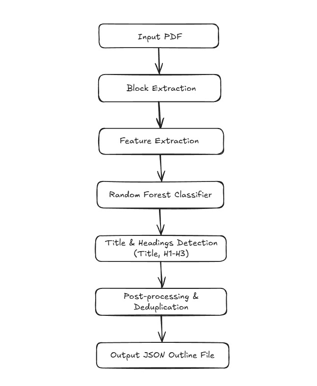

# Challenge 1a: PDF Processing Solution

## 📄 Document Outline Extractor: Hybrid ML Pipeline for PDF Structural Understanding

## Problem Statement
Extracting a structured title and outline (H1, H2, etc.) from arbitrary PDFs is a classic **document intelligence** challenge.  
Traditional rule-based logic fails on diverse real-world files—fonts, layouts, and languages change too much.

Our pipeline combines layout-aware ML, robust feature engineering, and a clean output format to extract structured outlines that power search, summaries, and automation.

---

## Solution
Our solution combines layout-aware machine learning with robust feature engineering to accurately identify document titles and headings. It uses PyMuPDF for text and layout parsing and a Random Forest classifier for block-level prediction. The output is a standardized, machine-readable JSON that captures the document’s full outline, making it usable for downstream tasks.

---

## Approach




1. **PDF Parsing:** Each PDF is divided into text blocks using **PyMuPDF**.
2. **Feature Extraction:** For every block, features such as font size, boldness, line count, uppercase ratio, and numbered patterns are collected, along with context from neighboring blocks.
3. **Machine Learning Classification:** These features are input to a **Random Forest** model, which predicts if each block is a `TITLE`, a heading (`H1`, `H2`, `H3`), or regular `BODY` text.
4. **Outline Construction:** The detected title and all heading blocks (with page numbers) are compiled into a hierarchical outline.
5. **Post-Processing:** Duplicate headings are removed, and special handling ensures every document gets a valid title and outline.
6. **Output:** The final structured outline is saved as a **JSON** file, ready for downstream applications.

---

## How It Works

### 1. Layout-Aware Feature Extraction
Every PDF is parsed with **PyMuPDF** to extract each block of text along with its visual and typographic features:
- **Font size** (median per block)
- **Boldness** (any part bold/black/heavy)
- **Line count** (multi-line headings)
- **Uppercase ratio** (indicator for titles)
- **Numbered/structured prefix detection** (e.g., `1.1`, `A.`, `•`, etc.)
- **Context** from previous and next blocks

### 2. Supervised Machine Learning
Blocks are vectorized using all features and classified with a **Random Forest model** (via scikit-learn) into:
- `TITLE`: Main document title (once per doc)
- `H1`, `H2`, `H3`: Headings and sub-headings
- `BODY`: Regular paragraph content

### 3. Block Label Alignment & Training
For training, block texts are matched to ground-truth headings using **normalization** and **fuzzy semantic matching**, allowing robust learning even from noisy or OCR-generated data.

### 4. Outline Assembly & Title Patching
- The first `TITLE` block (or the largest-font block) is selected as the **document title**.
- All predicted **H\*** blocks form the outline along with their respective page numbers.
- Results are **deduplicated**, **sorted**, and “**patched**” with fallback logic to ensure a valid output for every document.

---

## 4. Structured Output: Clean JSON
Each PDF generates a machine-readable JSON file:

```json
{
  "title": "Comprehensive AI Methods",
  "outline": [
    { "level": "H1", "text": "Introduction", "page": 1 },
    { "level": "H2", "text": "Background", "page": 2 }
  ]
}
```
This output feeds directly into downstream summarization, UI, or analytics tools.

---

# 5. Project Structure
```
.
├── data/
│   ├── pdfs/                        # PDFs for training
│   └── jsons/                       # Ground truth labels for training
├── input/                           # PDFs for prediction (inference)
├── output/                          # Outline JSONs for each input PDF
├── models/                          # Trained RandomForest model
├── process_pdfs.py                  # Main code (train + inference)
├── requirements.txt                 # Dependencies
├── Dockerfile                       # Containerization
└── approach_explanation.md          # This documentation
```

---

## 6. End-to-End Workflow

### Initialize
- If model not present, pipeline trains from `/data/pdfs` + `/data/jsons`
- Otherwise, loads trained model from `/models/`

### Process
- All PDFs in `/input/` are block-parsed
- Blocks vectorized, classified, and outline + title assembled
- Results saved as `/output/yourfile.json`

---

## 7. Key Features & Constraints
- **Fast**: ≤ 10 seconds for a 50-page PDF (on 8 CPU / 16 GB RAM)
- **Visual Structure Learning**: Font, layout, context—beyond regex
- **Lightweight**: Model size ≤ 200 MB, fully CPU, no GPU required
- **Reproducible**: Same input = same output, every run
- **Offline**: No network calls; all processing is local and secure
- **Multilingual Ready**: Unicode normalization for non-English scripts
- **Modular**: Easy retrain, feature extension, or model swap
- **No Hardcoding**: Never rely on specific file logic—generalizes robustly

---

## 8. Dockerized Execution

### Build Image
```bash
docker build --platform linux/amd64 -t challenge_1a.commit_to_win .
```
### Run 
```bash
docker run --rm -v $(pwd)/input:/app/input -v $(pwd)/output:/app/output --network none challenge_1a.commit_to_win
```

---

# Conclusion
This pipeline bridges rule-based and learning-based methods for robust, layout-agnostic outline extraction—reliable, explainable, and ready for the real world.
